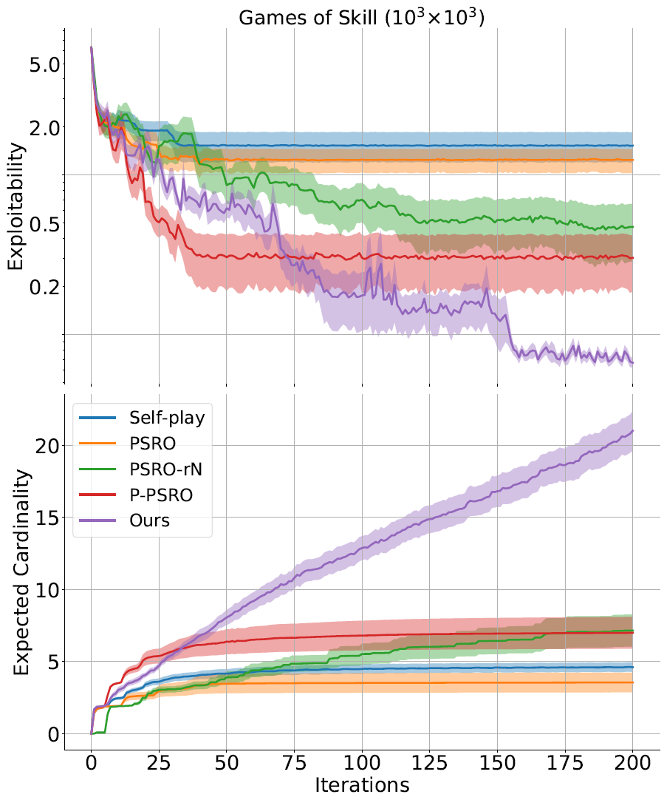
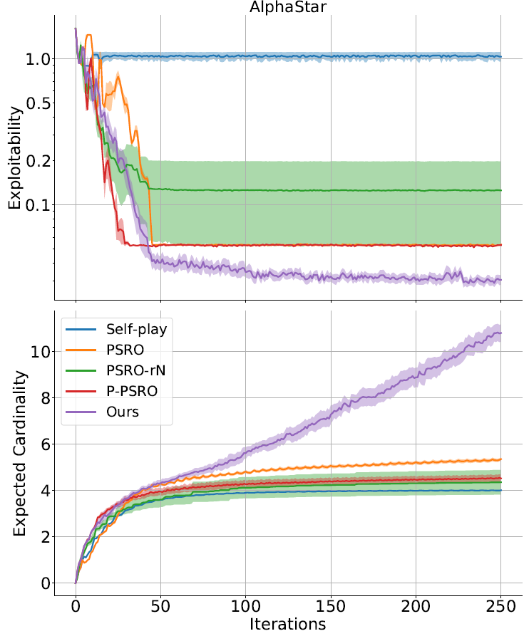
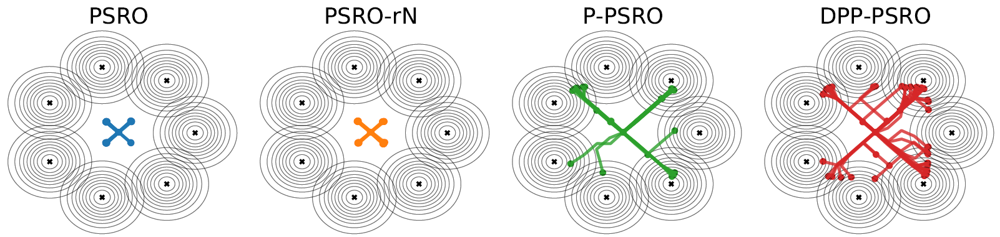
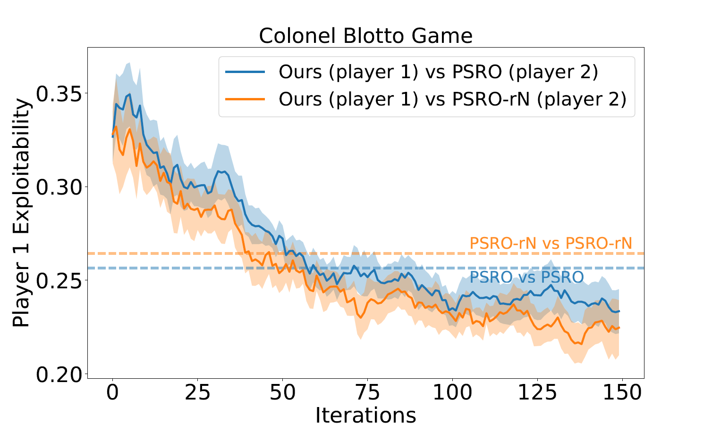

# Diverse PSRO

### Diverse PSRO

> Diverse PSRO is a variation of the Policy Space Response Oracle algorithm which promotes training a behaviourally diverse set of policies by using the theory of determinantal 
point processes (DPPs). This approach allows to train less exploitable more diverse strategies as well as bringing a new geometrically interpretable way of measuring 
population diversity.


### How to run Diverse PSRO

The code on this repository can be run by cloning the repository

```shell
git clone https://github.com/diversepsro/diverse_psro
```

Creating a new [Anaconda](https://www.anaconda.com/) environment

```shell
conda env create -f environment.yml
conda activate diverse_psro
```

You can now run Random Games of Skill by executing

```shell
python3 random_games_skill.py
```

You can now run Real World Meta-Games by executing

```shell
python3 sspinning_topss_dpp.py
```

You can now run Non-transitive Mixture Model by executing

```shell
python3 non_mixture_model.py
```

Running colonel Blotto requires to install [open_spiel](https://github.com/deepmind/open_spiel/tree/549e48010a81c023902a39c41319ed08769d3f26) in addition, then running

```shell
python3 blotto/blotto.py
```


### Performance of Diverse PSRO

Diverse PSRO is evaluated in three different settings, each of them using a different version of diverse oracle.

|              Game               |           Oracle          |
| :-----------------------------: | :-----------------------: |
|     Random Games of Skill       |         Diverse BR        |
|     Real World Meta-Games       |         Diverse BR        |
|  Non-transitive mixture model   |  Diverse gradient ascent  |
|         Colonel Blotto          |     Diverse zero-order    |


## Random Games of Skill



## Real World Meta-Games



## Non-transitive mixture model



## Blotto


