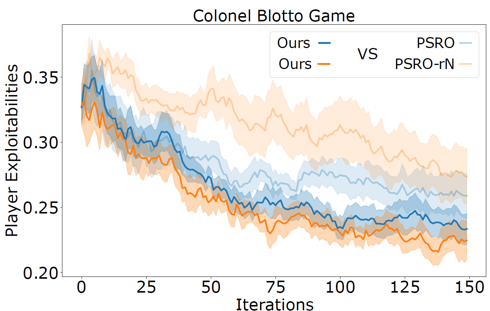

# Diverse PSRO

### Diverse PSRO

> Diverse PSRO is a variation of the Policy Space Response Oracle algorithm which promotes training a behaviourally diverse set of policies by using the theory of determinantal 
point processes (DPPs). This approach allows to train less exploitable more diverse strategies as well as bringing a new geometrically interpretable way of measuring 
population diversity.

### How to run Diverse PSRO

### Performance of Diverse PSRO

> Diverse PSRO is evaluated in three different setting, each of them using a different version of diverse oracle.

|              Game               |           Oracle          |
| :-----------------------------: | :-----------------------: |
|    Random Normal Form Games     |         Diverse BR        |
|     2D Rock Paper Scissors      |  Diverse gradient ascent  |
|             Blotto              |     Diverse zero-order    |

## Random Normal Form Games

## 2D Rock Paper Scissors

## Blotto

